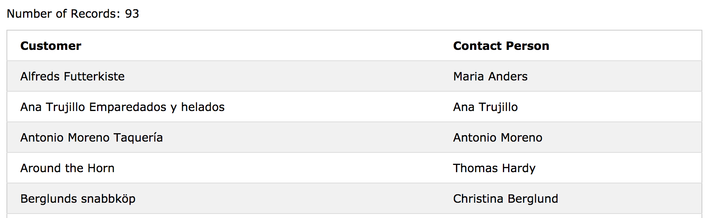
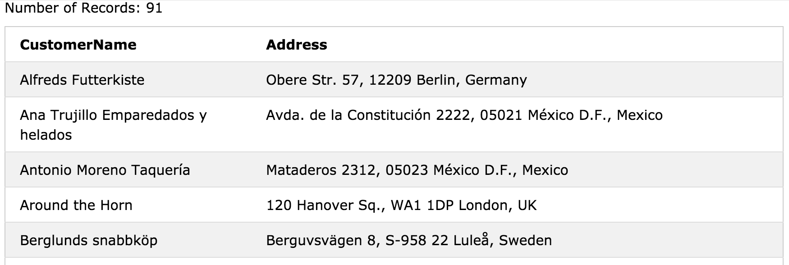
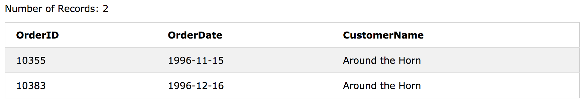

# SQL Aliases(별칭)


SQL 별칭은 테이블 또는 테이블의 열에 임시 이름을 지정하는 데 사용됩니다. 

별명은 종종 열 이름을 읽기 쉽게하기 위해 사용됩니다. 

별칭은 쿼리 기간 동안 만 존재합니다.


### Alias Column Syntax

```sql
SELECT column_name AS alias_name
FROM table_name;
```

### Alias Table Syntax

```sql
SELECT column_name(s)
FROM table_name AS alias_name;
```
#### Demo Database


## Alias for Columns Examples

다음 SQL 문은 CustomerID 열과 CustomerName 열의 두 가지 별칭을 만듭니다.

```sql
SELECT CustomerID as ID, CustomerName AS Customer
FROM Customers;
```

다음 SQL 문은 CustomerName 열과 ContactName 열의 두 가지 별칭을 만듭니다. 
>참고 : 별칭 이름에 공백이 포함되어 있으면 큰 따옴표 또는 대괄호가 필요합니다.

```sql
SELECT CustomerName AS Customer, ContactName AS [Contact Person]
FROM Customers;
```


다음 SQL 문은 네 개의 열 (Address, PostalCode, City 및 Country)을 결합하는 'Address'라는 별칭을 만듭니다.

```sql
SELECT CustomerName, Address + ', ' + PostalCode + ' ' + City + ', ' + Country AS Address
FROM Customers;
```


## Alias for Tables Example

다음 SQL 문은 CustomerID = 4 (Around the Horn) 인 고객의 모든 주문을 선택합니다.
'Customers'및 'Orders'테이블을 사용하고 각각 'c'및 'o'테이블 별칭을 부여합니다 (여기서 별칭을 사용하여 SQL을 더 짧게 만듭니다).

```sql
SELECT o.OrderID, o.OrderDate, c.CustomerName
FROM Customers AS c, Orders AS o
WHERE c.CustomerName="Around the Horn" AND c.CustomerID=o.CustomerID;
```



다음 SQL 문은 위와 동일하지만 별칭이 없습니다.

```sql
SELECT Orders.OrderID, Orders.OrderDate, Customers.CustomerName
FROM Customers, Orders
WHERE Customers.CustomerName="Around the Horn" AND Customers.CustomerID=Orders.CustomerID;
```


#### 별칭은 다음과 같은 경우에 유용 할 수 있습니다. 

- 여러 개의 테이블이 쿼리에 포함되어 있을 때
- 함수가 쿼리에 사용될 때
- 열 이름이 크거나 읽기 어렵울 때
- 두 개 이상의 열이 함께 결합할 때