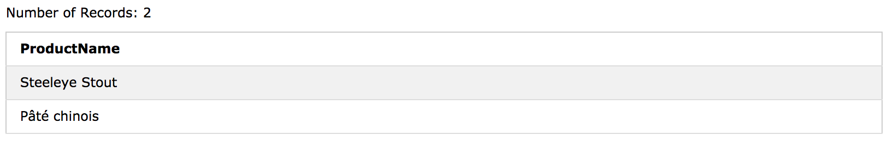

# SQL ANY and ALL 연산자

- ANY 와 ALL 연산자는 WHERE 또는 HAVING 절과 함께 사용됩니다. 
- ANY 연산자는 하위 쿼리 값 중 하나가 조건을 충족하면 True를 반환합니다. 
- ALL 연산자는 모든 하위 쿼리 값이 조건을 충족하면 True를 반환합니다.

## ANY Syntax

```sql
SELECT column_name(s)
FROM table_name
WHERE column_name operator ANY
(SELECT column_name FROM table_name WHERE condition);
```

## ALL Syntax

```sql
SELECT column_name(s)
FROM table_name
WHERE column_name operator ALL
(SELECT column_name FROM table_name WHERE condition);
```
> Note: 연산자는 표준 비교 연산자 (=, <>,! =,>,> =, <또는 <=) 여야합니다.
> 

#### Demo Database


### SQL ANY Examples

하위 쿼리 값 중 하나가 조건을 충족하면 ANY 연산자는 TRUE를 반환합니다. 

다음 SQL 문은 TRUE를 반환하고 OrdersDetails 테이블에 quantity = 10 인 레코드가 있으면 productnames를 나열합니다.

```sql
SELECT ProductName
FROM Products
WHERE ProductID = ANY (SELECT ProductID FROM OrderDetails WHERE Quantity = 10);
```


다음 SQL 문 은 TRUE를 리턴하고 quantity> 99 인 OrderDetails 테이블에 모든 레코드를 찾으면 제품 이름을 나열합니다.

```sql

SELECT ProductName
FROM Products
WHERE ProductID = ANY (SELECT ProductID FROM OrderDetails WHERE Quantity > 99);
```



ALL 연산자는 모든 하위 쿼리 값이 조건을 충족하면 TRUE를 반환합니다. 

### SQL ALL Example

OrderDetails 테이블의 모든 레코드가 quantity = 10이면 다음 SQL 문은 TRUE를 반환하고 제품 이름을 나열합니다.

```sql
SELECT ProductName
FROM Products
WHERE ProductID = ALL (SELECT ProductID FROM OrderDetails WHERE Quantity = 10);
```
