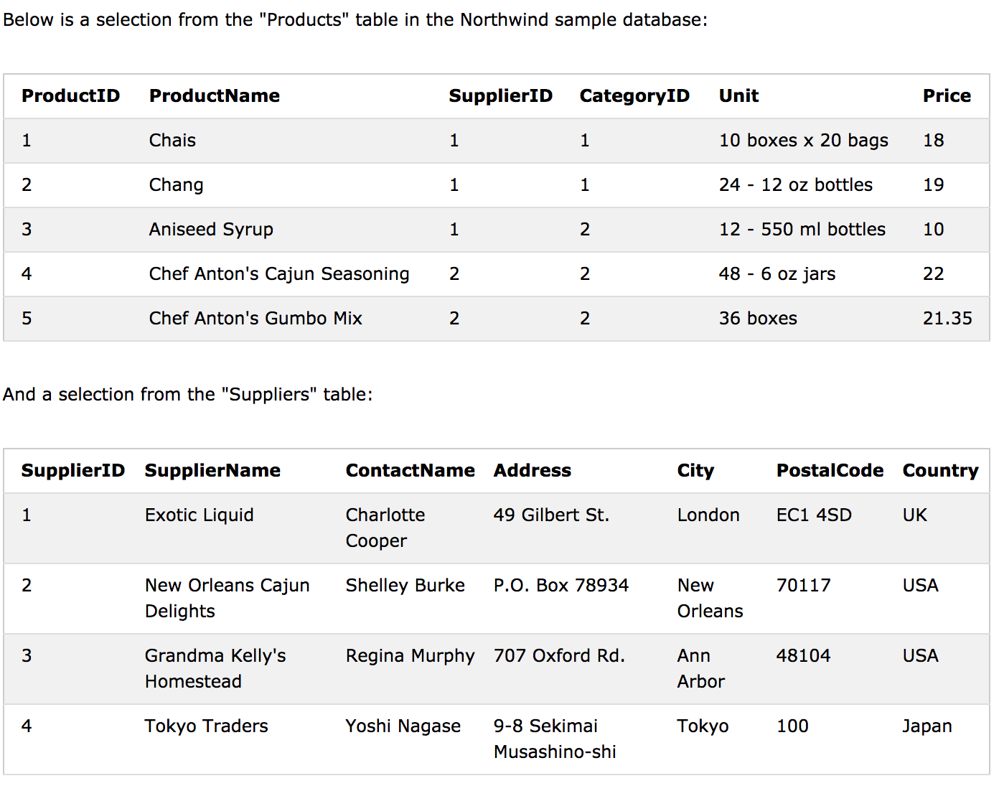
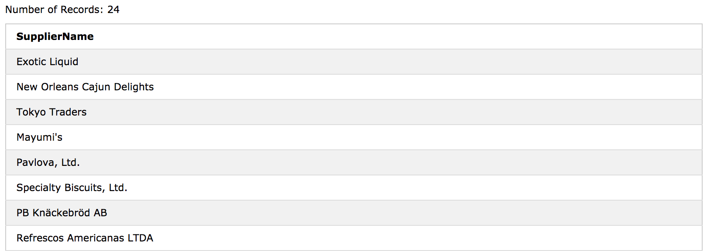
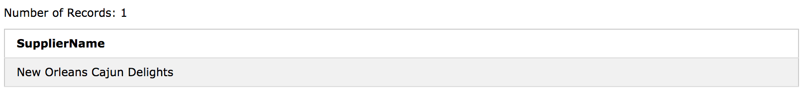

 # SQL EXISTS 연산자
  
  EXISTS 연산자는 subquery의 레코드 존재 여부를 테스트하는 데 사용됩니다. 

EXISTS 연산자는 subquery가 하나 이상의 레코드를 반환하면 true를 반환합니다.

## EXISTS Syntax

```sql
SELECT column_name(s)
FROM table_name
WHERE EXISTS
(SELECT column_name FROM table_name WHERE condition);
```
#### Demo Database



### SQL EXISTS Examples

다음 SQL 문은 TRUE를 반환하고 제품 가격이 20 미만인 공급 업체를 나열합니다.

```sql
SELECT SupplierName
FROM Suppliers
WHERE EXISTS (SELECT ProductName FROM Products WHERE SupplierId = Suppliers.supplierId AND Price < 20);
```


다음 SQL 문은 TRUE를 반환하고 제품 가격이 22 인 공급 업체를 나열합니다.

```sql
SELECT SupplierName
FROM Suppliers
WHERE EXISTS (SELECT ProductName FROM Products WHERE SupplierId = Suppliers.supplierId AND Price = 22);
```


