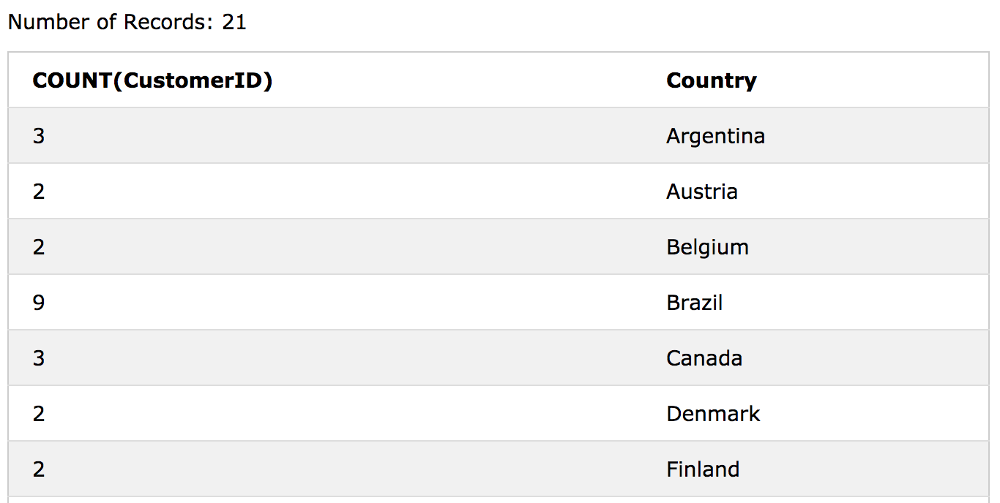
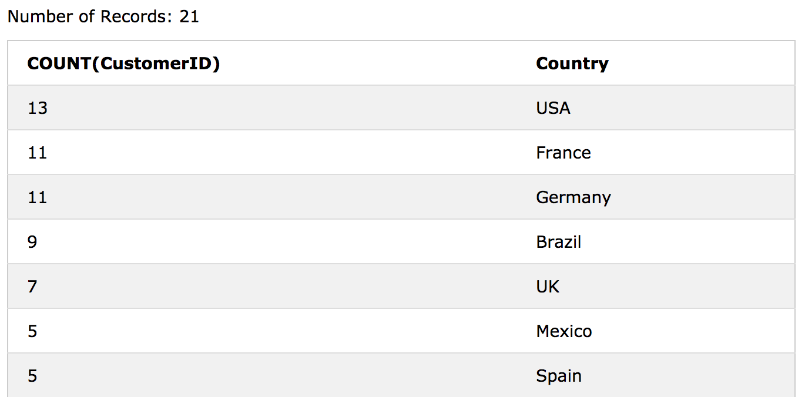
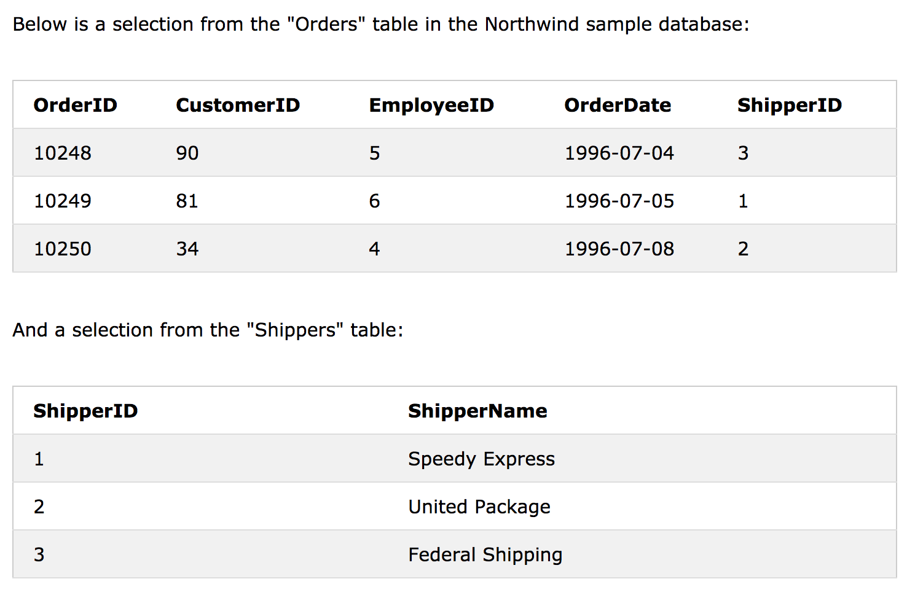
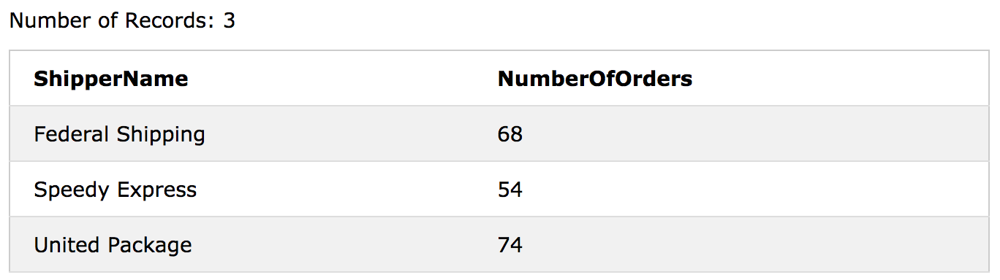

# SQL - GROUP BY 

GROUP BY 문은 집계 함수 (COUNT, MAX, MIN, SUM, AVG)와 함께 사용되어 결과 집합을 하나 이상의 열로 그룹화합니다.

## GROUP BY Syntax

```sql
SELECT column_name(s)
FROM table_name
WHERE condition
GROUP BY column_name(s)
ORDER BY column_name(s);
```
#### Demo Database


### SQL GROUP BY Examples

다음 SQL 문은 각 국가의 고객 수를 나열합니다.

```sql
SELECT COUNT(CustomerID), Country
FROM Customers
GROUP BY Country;
```


다음 SQL 문은 각 국가의 고객 수를 높이에서 낮은 순으로 정렬하여 나열합니다.

```sql
SELECT COUNT(CustomerID), Country
FROM Customers
GROUP BY Country
ORDER BY COUNT(CustomerID) DESC;
```


#### Demo Database



### GROUP BY With JOIN Example

다음 SQL 문은 각 발송인이 보낸 주문 수를 나열합니다.

```sql
SELECT Shippers.ShipperName, COUNT(Orders.OrderID) AS NumberOfOrders FROM Orders
LEFT JOIN Shippers ON Orders.ShipperID = Shippers.ShipperID
GROUP BY ShipperName;
```
