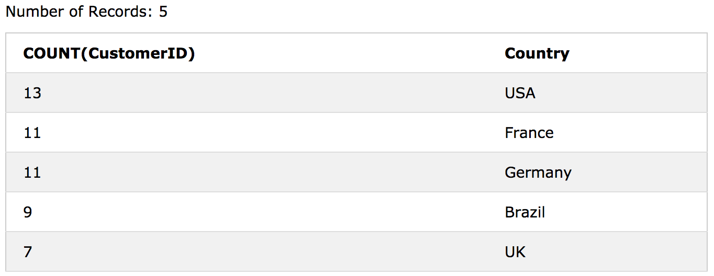

# SQL - HAVING 

WHERE 키워드를 집계 함수와 함께 사용할 수 없으므로 HAVING 절이 SQL에 추가되었다.

## HAVING Syntax

```sql
SELECT column_name(s)
FROM table_name
WHERE condition
GROUP BY column_name(s)
HAVING condition
ORDER BY column_name(s);
```

#### Demo Database


### SQL HAVING Examples

다음 SQL 문은 각 국가의 고객 수를 나열합니다. 5 명 이상의 고객이있는 국가만 포함 :

```sql
SELECT COUNT(CustomerID), Country
FROM Customers
GROUP BY Country
HAVING COUNT(CustomerID) > 5;
```


다음 SQL 문은 각 국가의 고객 수를 높은 순으로 정렬하여 나열합니다 (고객이 5 명 이상인 국가 만 포함).

```sql
SELECT COUNT(CustomerID), Country
FROM Customers
GROUP BY Country
HAVING COUNT(CustomerID) > 5
ORDER BY COUNT(CustomerID) DESC;
```


#### Demo Database


## More HAVING Examples

다음 SQL 문은 10 개 이상의 주문을 등록한 직원을 나열합니다.

```sql
SELECT Employees.LastName, COUNT(Orders.OrderID) AS NumberOfOrders
FROM (Orders
INNER JOIN Employees ON Orders.EmployeeID = Employees.EmployeeID)
GROUP BY LastName
HAVING COUNT(Orders.OrderID) > 10;
```


"Davolio"또는 "Fuller"직원이 25 개가 넘는 주문을 등록한 경우 다음 SQL 문에 나열됩니다.

```sql
SELECT Employees.LastName, COUNT(Orders.OrderID) AS NumberOfOrders
FROM Orders
INNER JOIN Employees ON Orders.EmployeeID = Employees.EmployeeID
WHERE LastName = 'Davolio' OR LastName = 'Fuller'
GROUP BY LastName
HAVING COUNT(Orders.OrderID) > 25;
```


