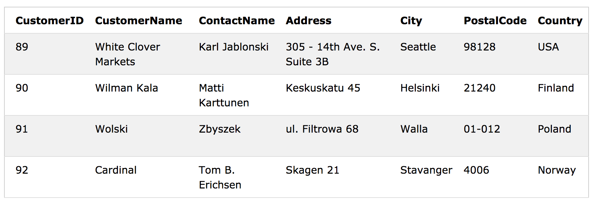
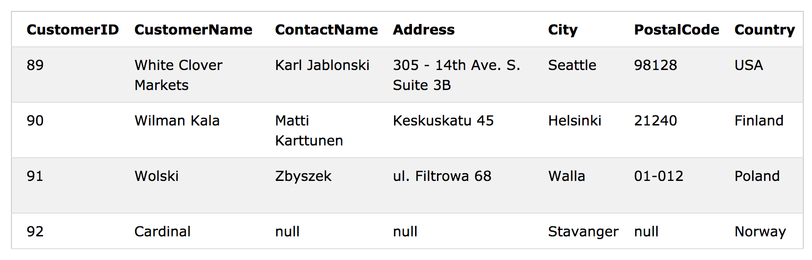

# SQL - INSERT INTO Statement

INSERT INTO 문은 테이블에 새 레코드를 삽입하는 데 사용됩니다.

## INSERT INTO Syntax


두 가지 방법으로 INSERT INTO 문을 작성할 수 있습니다. 

 - 첫 번째 방법은 적용 할 열의 이름과 값을 모두 지정합니다.
 
```sql
INSERT INTO table_name (column1, column2, column3, ...)
VALUES (value1, value2, value3, ...);
```

 표의 모든 열에 값을 추가하는 경우 SQL 조회에서 열의 이름을 지정할 필요가 없습니다. 
 그러나 값의 순서가 테이블의 열과 동일한 순서인지 확인하십시오. 
`INSERT INTO` 구문은 다음과 같습니다.

```sql
INSERT INTO table_name
VALUES (value1, value2, value3, ...);
```

### Demo Database


## INSERT INTO Example

다음 SQL 문은 'Customers'테이블에 새 레코드를 삽입합니다.

```sql
INSERT INTO Customers (CustomerName, ContactName, Address, City, PostalCode, Country)
VALUES ('Cardinal', 'Tom B. Erichsen', 'Skagen 21', 'Stavanger', '4006', 'Norway');
```
'Customers'테이블의 선택은 다음과 같습니다.



## Insert Data Only in Specified Columns

특정 열에 만 데이터를 삽입 할 수도 있습니다. 

다음 SQL 문은 새 레코드를 넣는다. 'CustomerName', 'City'및 'Country'열에 만 데이터를 삽입합니다 (CustomerID는 자동으로 업데이트됩니다).

```sql
INSERT INTO Customers (CustomerName, City, Country)
VALUES ('Cardinal', 'Stavanger', 'Norway');
```

