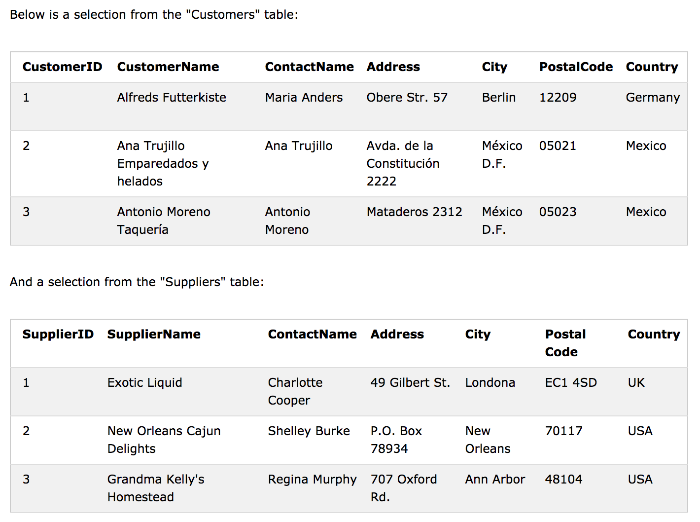

# SQL - INSERT INTO SELECT 

INSERT INTO SELECT 문은 한 테이블의 데이터를 복사하여 다른 테이블에 넣는다. 

INSERT INTO SELECT는 소스 및 목표 테이블의 데이터 유형이 일치해야합니다. 목표 테이블의 기존 레코드는 영향을받지 않습니다.

## INSERT INTO SELECT Syntax

한 테이블의 모든 열을 다른 테이블로 복사 :

```sql
INSERT INTO table2
SELECT * FROM table1
WHERE condition;
Copy only some columns from one table into another table:
```
한 테이블의 일부 열만 다른 테이블로 복사 :

```sql
INSERT INTO table2 (column1, column2, column3, ...)
SELECT column1, column2, column3, ...
FROM table1
WHERE condition;
```
#### Demo Database



### SQL INSERT INTO SELECT Examples

다음 SQL 문은 'Suppliers'를 'Customers'로 복사합니다 (데이터가 채워지지 않은 열은 NULL을 포함합니다).

```sql
INSERT INTO Customers (CustomerName, City, Country)
SELECT SupplierName, City, Country FROM Suppliers;
```

다음 SQL 문은 'Suppliers'를 'Customers'로 복사합니다 (모든 열을 채움):

```sql
INSERT INTO Customers (CustomerName, ContactName, Address, City, PostalCode, Country)
SELECT SupplierName, ContactName, Address, City, PostalCode, Country FROM Suppliers;
```

다음 SQL 문은 독일 공급 업체만을 '고객'으로 복사합니다.

```sql
INSERT INTO Customers (CustomerName, City, Country)
SELECT SupplierName, City, Country FROM Suppliers
WHERE Country='Germany';
```
