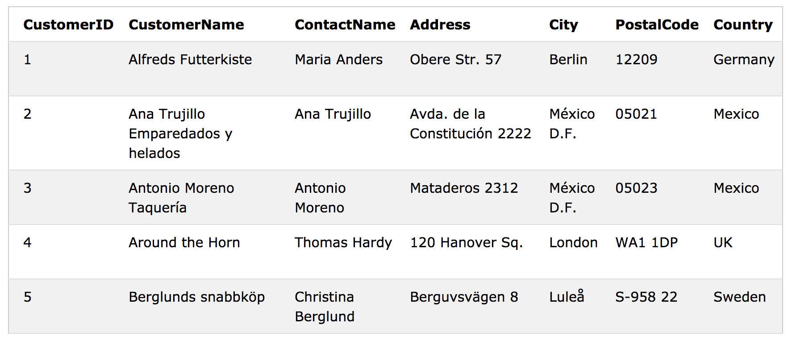

# SQL Tutorial

>SQL은 데이터베이스의 데이터를 저장, 조작 및 검색하기 위한 표준 언어이다. 
>
>SQL 튜토리얼은 MySQL, SQL Server, MS Access, Oracle, Sybase, Informix, Postgres 및 기타 데이터베이스 시스템에서 SQL을 사용하는 방법을 알려준다.


## SQL 이란?

- SQL은 구조화 된 쿼리 언어 (Structured Query Language)의 약자이다. 
- SQL을 사용하면 데이터베이스를 액세스하고 조작 할 수 있다. 
- SQL은 ANSI (American National Standards Institute) 표준이다.

## SQL로 무엇을 할 수 있나?

- SQL은 데이터베이스에 대해 쿼리를 실행할 수 있다. 
- SQL은 데이터베이스에서 데이터를 검색 할 수 있다. 
- SQL은 데이터베이스에 레코드를 삽입 할 수 있다. 
- SQL은 데이터베이스의 레코드를 업데이트 할 수 있다. 
- SQL은 데이터베이스에서 레코드를 삭제할 수 있다. 
- SQL은 데이터베이스의 새 테이블을 만들 수 있다.
- SQL은 데이터베이스에 저장 프로 시저를 만들 수 있다. 
- SQL은 데이터베이스에 뷰를 만들 수 있습니다. 
- SQL은 테이블, 프로시저 및 뷰에 대한 사용 권한을 설정할 수 있다.


## SQL은 표준입니다. 그러나 ... 

SQL은 ANSI (American National Standards Institute) 표준이지만 다른 SQL 버전이 있다. 

그러나 ANSI 표준을 준수하기 위해서는 비슷한 방식으로 최소한 SELECT, UPDATE, DELETE, INSERT, WHERE 등의 주요 명령을 모두 지원해야한다.

## RDBMS 

RDBMS는 관계형 데이터베이스 관리 시스템의 약자입니다. 

RDBMS는 SQL, MS SQL Server, IBM DB2, Oracle, MySQL 및 Microsoft Access와 같은 모든 최신 데이터베이스 시스템의 기초입니다. 

RDBMS의 데이터는 테이블이라는 데이터베이스 객체에 저장됩니다. 테이블은 관련 데이터 항목의 모음이며 열과 행으로 구성됩니다. 

## SQL Syntax

### Database Tables

데이터베이스는 대개 하나 이상의 테이블을 포함합니다. 각 표는 이름 (예 : '고객'또는 '주문')으로 식별됩니다. 테이블은 데이터가있는 레코드 (행)를 포함합니다. 

이 tutorial에서는 잘 알려진 Northwind 예제 데이터베이스 (MS Access 및 MS SQL Server에 포함)를 사용합니다.

###### Below is a selection from the "Customers" table:




위의 표에는 다섯 개의 레코드 (각 고객 당 하나)와 일곱 개의 열 (CustomerID, CustomerName, ContactName, Address, City, PostalCode 및 Country)이 들어 있습니다.

## SQL Statements

데이터베이스에서 수행해야하는 대부분의 작동은 SQL 문으로 수행됩니다. 

다음 SQL 문은 Customers 테이블의 모든 레코드를 선택합니다.


```sql
SELECT * FROM Customers;
```

## 주의할 점 

- SQL 키워드는 대소 문자를 구분하지 않습니다 : select는 SELECT 와 같습니다.
- 이 튜토리얼에서는 모든 SQL 키워드를 대문자로 작성합니다.

## SQL 문 다음에 오는 세미콜론 `;` 은? 

일부 데이터베이스 시스템에서는 각 SQL 문의 끝에 세미콜론이 필요합니다. 

`;` 은 서버에 대한 동일한 호출에서 둘 이상의 SQL 문을 실행할 수 있도록하는 데이터베이스 시스템의 각 SQL 문을 구분하는 표준 방법입니다. 

이 튜토리얼에서는 각 SQL 문 끝에 세미콜론을 사용합니다.

## SQL에서 중요한 명령어

- **SELECT** - extracts data from a database
- **UPDATE** - updates data in a database
- **DELETE** - deletes data from a database
- **INSERT INTO** - inserts new data into a database
- **CREATE DATABASE** - creates a new database
- **ALTER DATABASE** - modifies a database
- **CREATE TABLE** - creates a new table
- **ALTER TABLE** - modifies a table
- **DROP TABLE** - deletes a table
- **CREATE INDEX** - creates an index (search key)
- **DROP INDEX** - deletes an index


