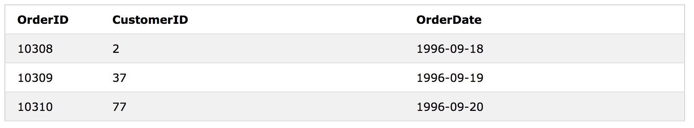
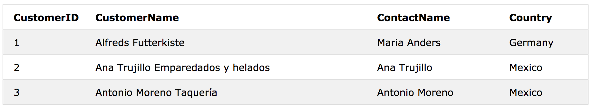
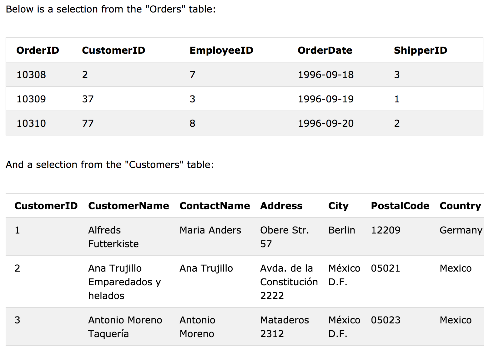
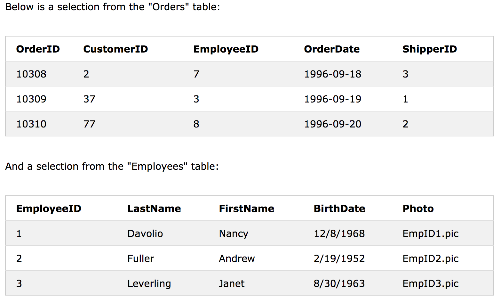

# SQL - Joins

JOIN 절은 두 개 이상의 테이블에있는 행을 결합하는 데 사용됩니다. 

**'Order'** 테이블에서 선택 항목을 살펴 보겠습니다.



그런 다음 **'Customer'** 테이블에서 선택 항목을 살펴보십시오.



'Order'테이블의 'CustomerID'열은 'Customer'테이블의 'CustomerID'를 나타냅니다. 
위의 두 테이블 사이의 관계는 'CustomerID'열입니다.

그런 다음 두 테이블에서 일치하는 값을 가진 레코드를 선택하는 다음 SQL 문 (INNER JOIN 포함)을 작성할 수 있습니다.

```sql
SELECT Orders.OrderID, Customers.CustomerName, Orders.OrderDate
FROM Orders
INNER JOIN Customers ON Orders.CustomerID=Customers.CustomerID;
```


## 다양한 유형의 SQL -JOIN

다음은 SQL에있는 JOIN의 여러 유형입니다.

 - **(INNER) JOIN:** 
   두 테이블에서 일치하는 값을 가진 레코드를 반환합니다.
 - **LEFT (OUTER) JOIN:**
   왼쪽 테이블의 모든 레코드와 오른쪽 테이블의 일치하는 레코드를 반환합니다. 
 - **RIGHT (OUTER) JOIN:** 
   오른쪽에서 모든 레코드를 반환합니다. 테이블 및 왼쪽 테이블의 일치 레코드 
 - **FULL (OUTER) JOIN:** 
   왼쪽 또는 오른쪽 테이블에서 일치하는 레코드가 있으면 모두 반환
 
 

 
# SQL - INNER JOIN Keyword

## INNER JOIN Syntax

```sql
SELECT column_name(s)
FROM table1
INNER JOIN table2 ON table1.column_name = table2.column_name;
```


### SQL INNER JOIN Example

```sql
SELECT Orders.OrderID, Customers.CustomerName
FROM Orders
INNER JOIN Customers ON Orders.CustomerID = Customers.CustomerID;
```


### JOIN Three Tables

다음 SQL 문은 customer 와  shipper 정보가 있는 모든 주문을 선택합니다.

```sql
SELECT Orders.OrderID, Customers.CustomerName, Shippers.ShipperName
FROM ((Orders
INNER JOIN Customers ON Orders.CustomerID = Customers.CustomerID)
INNER JOIN Shippers ON Orders.ShipperID = Shippers.ShipperID);
```


# SQL LEFT JOIN Keyword

LEFT JOIN 키워드는 왼쪽 테이블 (table1)의 모든 레코드와 오른쪽 테이블 (table2)의 일치 레코드를 반환합니다. 일치하는 것이 없으면 오른쪽에서 결과가 NULL입니다.

## LEFT JOIN Syntax

```sql
SELECT column_name(s)
FROM table1
LEFT JOIN table2 ON table1.column_name = table2.column_name;
```

#### Demo Database


### SQL LEFT JOIN Example

```sql 
SELECT Customers.CustomerName, Orders.OrderID
FROM Customers
LEFT JOIN Orders ON Customers.CustomerID = Orders.CustomerID
ORDER BY Customers.CustomerName;
```


>참고 : LEFT JOIN 키워드는 오른쪽 테이블 (Orders)에 일치하는 항목이 없더라도 왼쪽 테이블 (Customers)의 모든 레코드를 반환합니다.
>

# SQL - RIGHT JOIN Keyword

RIGHT JOIN 키워드는 오른쪽 테이블 (table2)의 모든 레코드와 왼쪽 테이블 (table1)의 일치 레코드를 반환합니다. 일치가없는 경우 결과는 왼쪽에서 NULL입니다.

## RIGHT JOIN Syntax

```sql
SELECT column_name(s)
FROM table1
RIGHT JOIN table2 ON table1.column_name = table2.column_name;
```


### SQL RIGHT JOIN Example

```sql
SELECT Orders.OrderID, Employees.LastName, Employees.FirstName
FROM Orders
RIGHT JOIN Employees ON Orders.EmployeeID = Employees.EmployeeID
ORDER BY Orders.OrderID;
```


>참고 : RIGHT JOIN 키워드는 왼쪽 테이블 (Orders)에 일치하는 항목이 없더라도 오른쪽 테이블 (Employees)의 모든 레코드를 반환합니다.
>


# SQL - FULL OUTER JOIN Keyword

**FULL OUTER JOIN** 키워드는 왼쪽 (table1) 또는 오른쪽 (table2) 테이블 레코드가 일치 할 때 모든 레코드를 리턴합니다. 

>note : FULL OUTER JOIN은 잠재적으로 매우 큰 결과 집합을 반환 할 수 있습니다.
>

## FULL OUTER JOIN Syntax

```sql
SELECT column_name(s)
FROM table1
FULL OUTER JOIN table2 ON table1.column_name = table2.column_name;
```

#### Demo Database


### SQL FULL OUTER JOIN Example

다음 SQL 문은 모든 고객과 모든 주문을 선택합니다. 

```sql
SELECT Customers.CustomerName, Orders.OrderID
FROM Customers
FULL OUTER JOIN Orders ON Customers.CustomerID=Orders.CustomerID
ORDER BY Customers.CustomerName;
```


>note : FULL OUTER JOIN 키워드는 왼쪽 테이블 (Customers)의 모든 행과 오른쪽 테이블 (Orders)의 모든 행을 리턴합니다. 
>
>'주문'에 일치하지 않는 행이 '고객'에 있거나 '고객'에 일치하지 않는 행이 '주문'에있는 경우 해당 행도 함께 표시됩니다.
>

## SQL Self JOIN

A self JOIN is a regular join, but the table is joined with itself.

### Self JOIN Syntax

```sql
SELECT column_name(s)
FROM table1 T1, table1 T2
WHERE condition;
```
#### Demo Database


### SQL Self JOIN Example

다음 SQL 문은 고객의 도시가 함께 일치합니다.

```sql
SELECT A.CustomerName AS CustomerName1, B.CustomerName AS CustomerName2, A.City
FROM Customers A, Customers B
WHERE A.CustomerID <> B.CustomerID
AND A.City = B.City 
ORDER BY A.City;
```
