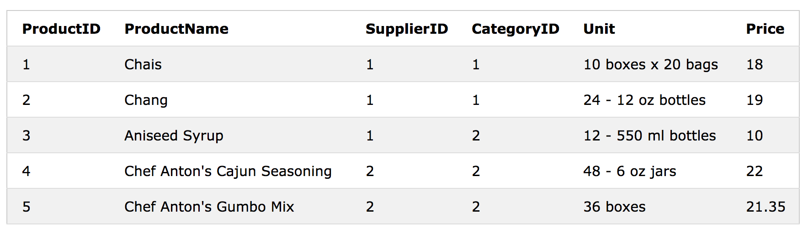
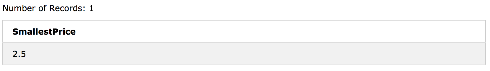
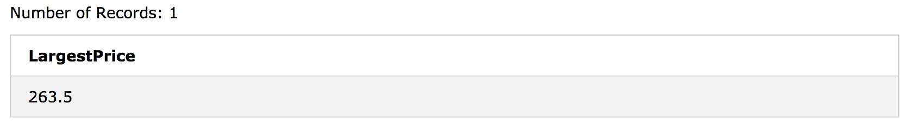

# SQL - MIN() , MAX() 함수

- MIN () 함수는 선택된 컬럼의 가장 작은 값을 리턴합니다. 
- MAX () 함수는 선택된 열의 가장 큰 값을 반환합니다.

### MIN() Syntax

```sql
SELECT MIN(column_name)
FROM table_name
WHERE condition;
```

### MAX() Syntax

```sql
SELECT MAX(column_name)
FROM table_name
WHERE condition;
```


### MIN() Example

다음 SQL 문은 가장 저렴한 제품의 가격을 찾습니다.

```sql
SELECT MIN(Price) AS SmallestPrice
FROM Products;
```



### MAX() Example

다음 SQL 문은 가장 비싼 제품의 가격을 찾습니다.

```sql
SELECT MAX(Price) AS LargestPrice
FROM Products;
```




