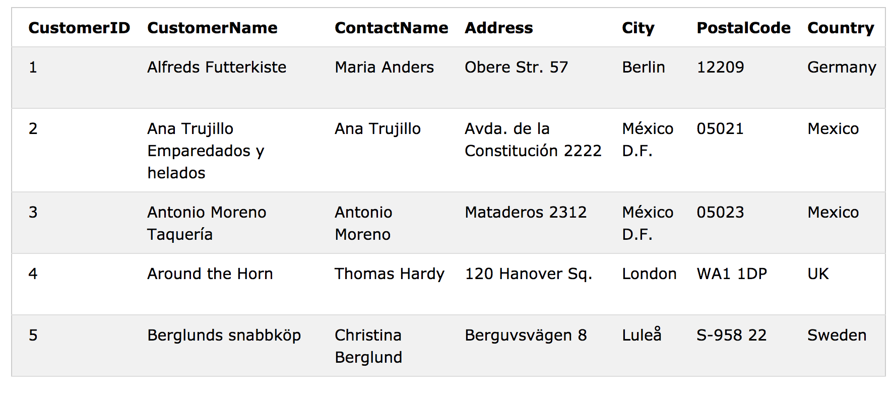
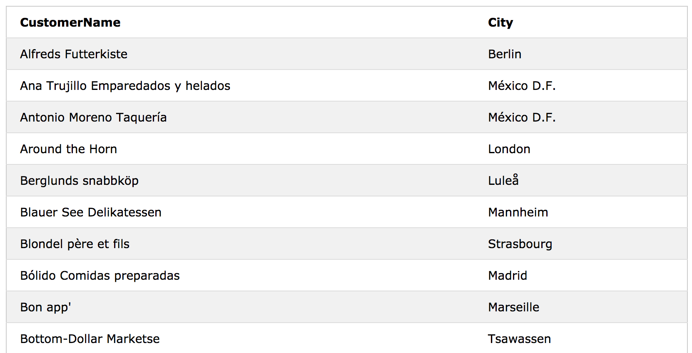
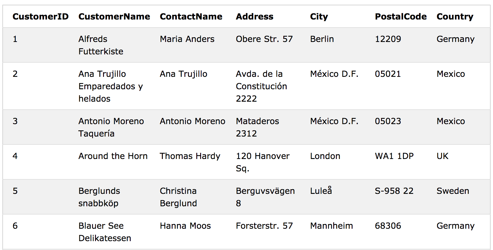
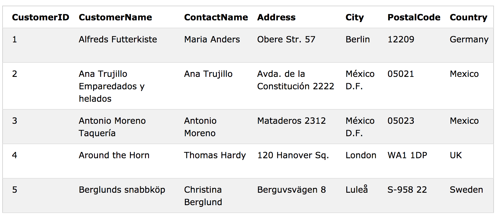
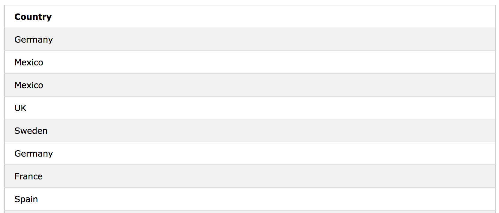
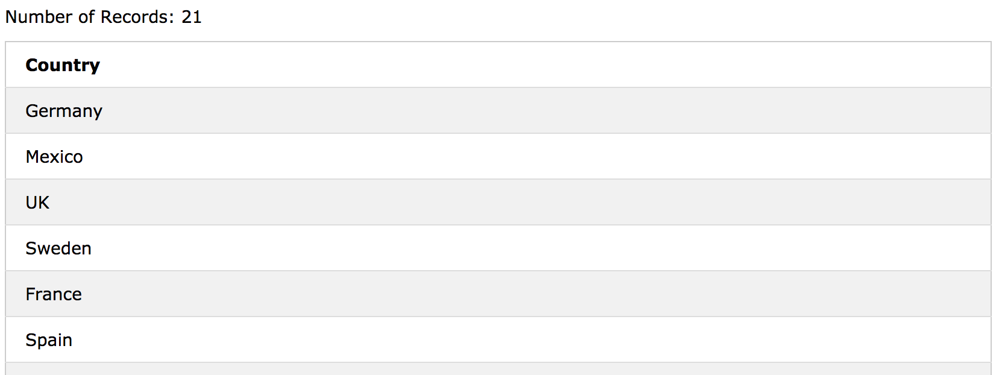
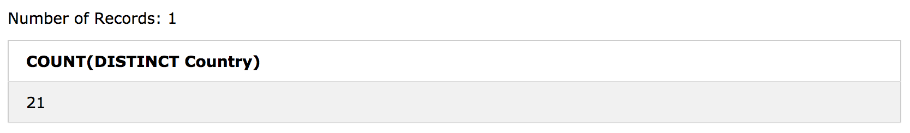
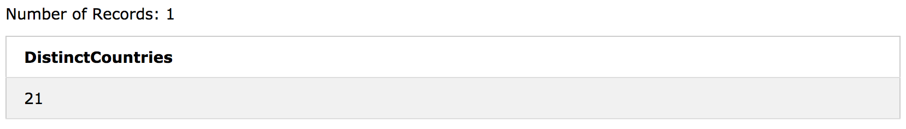

# SQL - SELECT 

**SELECT** 문은 데이터베이스에서 data를 선택하는 데 사용됩니다. 

return된 data는 table에 저장됩니다.result-set이라고 부른다.

### SELECT Syntax

```sql
SELECT column1, column2, ...
FROM table_name;
```
여기에서 `column1`, `column2`, ...는 데이터를 선택할 테이블의 필드 이름입니다. 
표에서 사용 가능한 모든 필드를 선택하려면 다음 구문을 사용하십시오.

```sql
SELECT * FROM table_name;
```

## Demo Database



column은 `,`로 구별하며 순서는 기재한 대로 나온다.

## SELECT Column Example

다음 SQL 문은 'Customers'테이블에서 'CustomerName'및 'City'열을 선택합니다.

```sql
SELECT CustomerName, City FROM Customers;
```


## SELECT * Example

```sql
SELECT * FROM Customers;
```


필드를 다 선택하고 싶으면 `*` 을 이용한다. 

## SQL SELECT DISTINCT

테이블 내에서 열은 종종 많은 중복 값을 포함합니다. 때로는 서로 다른 (	고유한) 값만 나열하려고한다.

**SELECT DISTINCT** 문은 고유한 (다른) 값만 반환하는 데 사용됩니다.

### SELECT DISTINCT Syntax

```
SELECT DISTINCT column1, column2, ...
FROM table_name;
```

### Demo Database



## SELECT Example

다음 SQL 문은 Customers 테이블의 'Country'열에있는 모든 (중복 된) 값을 선택합니다.

```
SELECT Country FROM Customers;
```


이제 DISTINCT 키워드를 위의 SELECT 문과 함께 사용하여 결과를 봅시다.

## SELECT DISTINCT Examples

```
SELECT DISTINCT Country FROM Customers;
```


다음 SQL 문은 서로 다른 (별개의) customer의 국가 수(count)를 나열합니다.

```
SELECT COUNT(DISTINCT Country) FROM Customers;
```


중복적용도 가능하다.

```
SELECT Count(*) AS DistinctCountries
FROM (SELECT DISTINCT Country FROM Customers);
```

