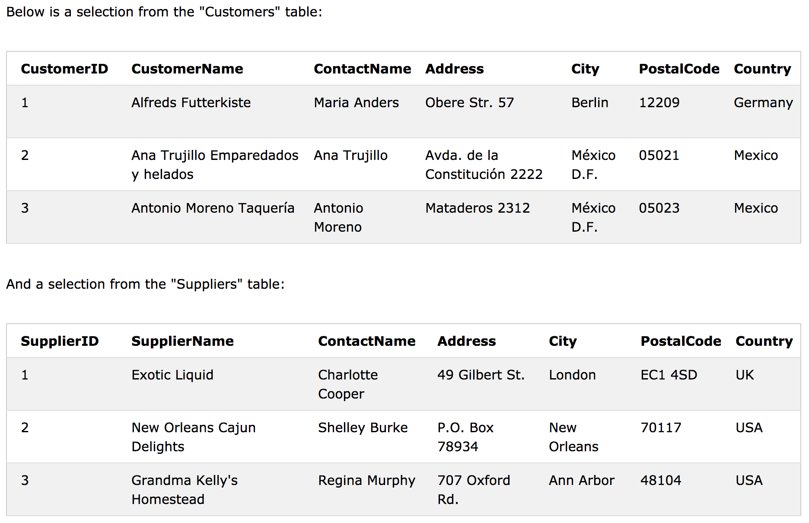
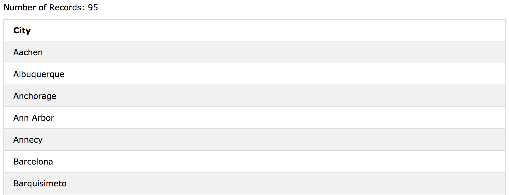
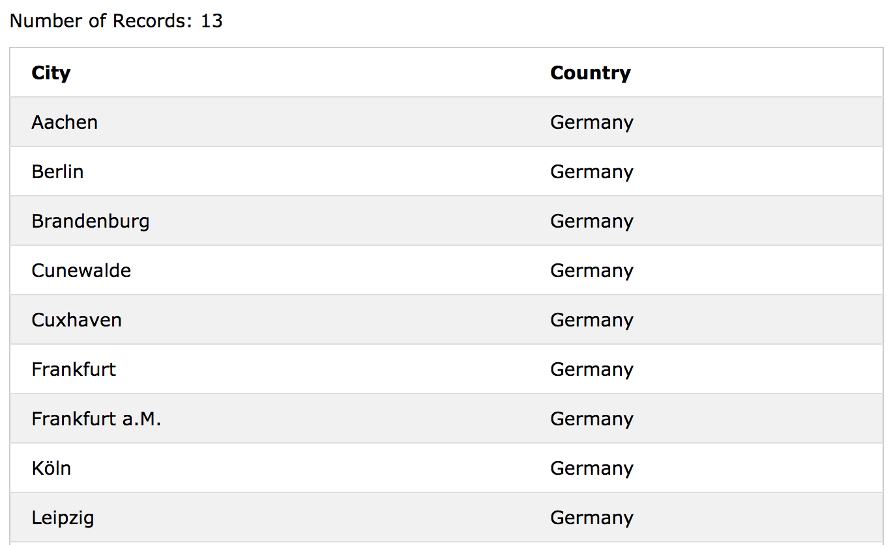

# SQL - UNION 연산자

UNION 연산자는 두 개 이상의 SELECT 문의 결과 집합을 결합하는 데 사용됩니다. 

 - UNION 내의 각 SELECT 문에는 같은 수의 열이 있어야합니다.  
 - 열은 유사한 데이터 형식을 가져야합니다.
 - 각 SELECT 문의 열은 같은 순서로 있어야합니다.

## UNION Syntax

```sql
SELECT column_name(s) FROM table1
UNION
SELECT column_name(s) FROM table2;
```
## UNION ALL Syntax

UNION 연산자는 기본적으로 고유 값만 선택합니다. 중복 값을 허용하려면 UNION ALL을 사용하십시오.

```sql
SELECT column_name(s) FROM table1
UNION ALL
SELECT column_name(s) FROM table2;
```
> note : result-set의 열 이름은 일반적으로 UNION의 첫 번째 SELECT 문의 열 이름과 동일합니다.
> 



### SQL UNION Example

다음 SQL 문은 'Customers'및 'Suppliers'에서 모든 다른 도시 (고유 한 값만)를 선택합니다.

```sql
SELECT City FROM Customers
UNION
SELECT City FROM Suppliers
ORDER BY City;
```



>note : 일부 고객 또는 공급 업체가 동일한 도시를 가지고있는 경우, UNION은 고유 한 값만 선택하기 때문에 각 도시는 한 번만 나열됩니다. UNION ALL을 사용하여 중복 값을 선택하십시오!
>

## SQL UNION With WHERE

다음 SQL 문은 'Customers'와'Suppliers'에서 모든 다른 독일 도시 (유일한 값만)를 선택합니다.

```sql
SELECT City, Country FROM Customers
WHERE Country='Germany'
UNION
SELECT City, Country FROM Suppliers
WHERE Country='Germany'
ORDER BY City;
```



## SQL UNION ALL With WHERE

다음 SQL 문은 'Customers'와 'Suppliers'에서 모든 독일 도시 (중복 값 또한) 선택합니다.

```sql
SELECT City, Country FROM Customers
WHERE Country='Germany'
UNION ALL
SELECT City, Country FROM Suppliers
WHERE Country='Germany'
ORDER BY City;
```


## Another UNION Example	
		
다음 SQL 문은 모든 고객과 공급자를 나열합니다.

```sql
SELECT 'Customer' As Type, ContactName, City, Country
FROM Customers
UNION
SELECT 'Supplier', ContactName, City, Country
FROM Suppliers;
```


