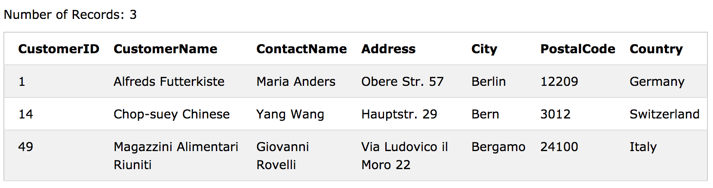
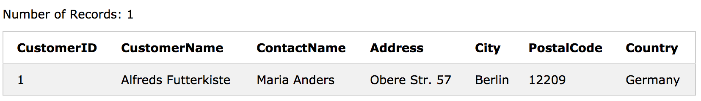
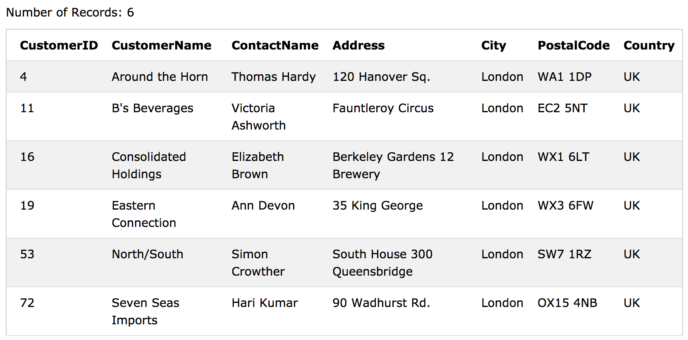
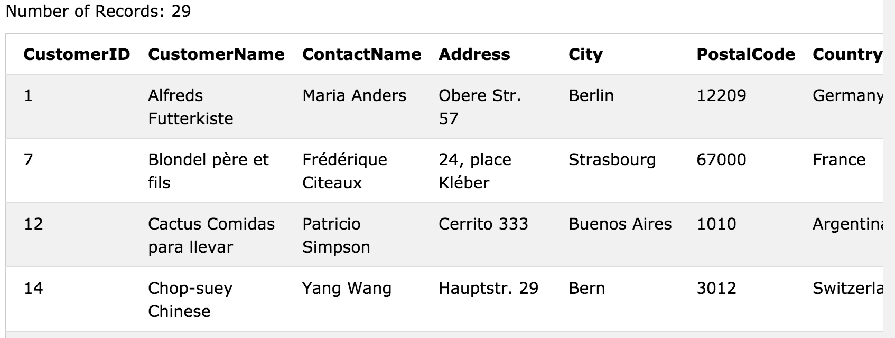

# SQL - Wildcard Characters

>와일드 카드 문자는 문자열의 다른 문자를 대체하는 데 사용됩니다. 
>
>와일드 카드 문자는 SQL LIKE 연산자와 함께 사용됩니다. LIKE 연산자는 WHERE 절에서 열의 지정된 패턴을 검색하는 데 사용됩니다. 

LIKE 연산자와 함께 사용되는 두 개의 와일드 카드가 있습니다. 

 - % - 백분율 기호는 0, 하나 또는 여러 문자를 나타냅니다. 
 - _ - 밑줄은 단일 문자를 나타냅니다


#### MS Access 및 SQL Server에서는 다음을 사용할 수도 있습니다. 

**[charlist]** - 일치시킬 문자와 세트의 범위를 정의합니다.
**[^ charlist]** - 일치하지 않는 문자의 집합과 범위를 정의합니다.

와일드 카드는 조합하여 사용할 수도 있습니다! 

#### 다음은 `%`와 `_` 와일드 카드가 있는 다른 LIKE 연산자를 보여주는 몇 가지 예입니다.

|LIKE Operator	|Description|
|----------|-------------|
|WHERE CustomerName LIKE `a%`	|`'a'`로 시작하는 값을 찾습니다.|
|WHERE CustomerName LIKE `%a`	|`'a'`로 끝나는 값을 찾습니다.|
|WHERE CustomerName LIKE `%or%`| `'or'`값이 있는 어느 위치의 값을 찾습니다.|
|WHERE CustomerName LIKE `_r%`	|두 번째 위치에 `'r'`이있는 값을 찾습니다.|
|WHERE CustomerName LIKE `a_%_%`	|`'a'`로 시작하고 길이가 3 자 이상인 값을 찾습니다.|
|WHERE ContactName LIKE `a%o`	|`'a'`로 시작하고 `'o'`로 끝나는 값을 찾습니다."|


### Using the % Wildcard

다음 SQL 문은 City가 'ber'로 시작하는 모든 고객을 선택합니다.

```sql
SELECT * FROM Customers
WHERE City LIKE 'ber%';
```



다음 SQL 문은 패턴이 'es'인 City가있는 모든 고객을 선택합니다.

```sql
SELECT * FROM Customers
WHERE City LIKE '%es%';
```

### Using the _ Wildcard

다음 SQL은 'erlin'으로 시작하는 도시가 있는 모든 고객을 선택합니다.

```sql
SELECT * FROM Customers
WHERE City LIKE '_erlin';
```



다음 SQL 문은 도시가 "L"로 시작하고 모든 문자, 그 다음에 "n"다음에 문자가오고 "on"이 뒤에 오는 모든 고객을 선택합니다.

```sql
SELECT * FROM Customers
WHERE City LIKE 'L_n_on';
```


### Using the [charlist] Wildcard


다음 SQL 문은 도시가 'b', 's'또는 'p'로 시작하는 모든 고객을 선택합니다.

```sql
SELECT * FROM Customers
WHERE City LIKE '[bsp]%';
```


다음 SQL 문은 도시가 'a', 'b'또는 'c'로 시작하는 모든 고객을 선택합니다.
```sql
SELECT * FROM Customers
WHERE City LIKE '[a-c]%';
```

### Using the [!charlist] Wildcard

다음 두 SQL 문은 'b', 's'또는 'p'로 시작하는 도시가 아닌 모든 고객을 선택합니다.

```sql
SELECT * FROM Customers
WHERE City LIKE '[!bsp]%';
```
or

```sql
SELECT * FROM Customers
WHERE City NOT LIKE '[bsp]%';
```

